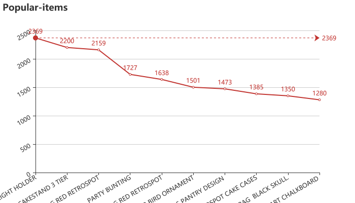
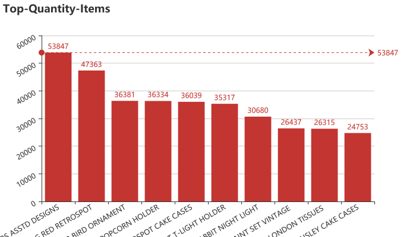
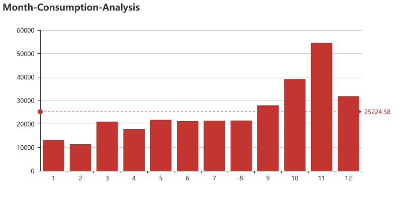

# Data Notes

<pre>
VARIABLE DESCRIPTIONS:
InvoiceNo:发票号码
StockCode:股票代码
Description:描述
Quantity:数量
InvoiceDate:发票日期
UnitPrice:单价
CustomerID:顾客ID
Country:国家
</pre>

___


```python
import warnings
warnings.filterwarnings("ignore")
```

# Read Data


```python
import pandas as pd
from pandas import Series,DataFrame
```


```python
data = pd.read_csv('./data/E-commerce-data.csv')
data.head()
```


<div>

<table border="1" class="dataframe">
  <thead>
    <tr style="text-align: right;">
      <th></th>
      <th>InvoiceNo</th>
      <th>StockCode</th>
      <th>Description</th>
      <th>Quantity</th>
      <th>InvoiceDate</th>
      <th>UnitPrice</th>
      <th>CustomerID</th>
      <th>Country</th>
    </tr>
  </thead>
  <tbody>
    <tr>
      <th>0</th>
      <td>536365</td>
      <td>85123A</td>
      <td>WHITE HANGING HEART T-LIGHT HOLDER</td>
      <td>6</td>
      <td>12/1/2010 8:26</td>
      <td>2.55</td>
      <td>17850.0</td>
      <td>United Kingdom</td>
    </tr>
    <tr>
      <th>1</th>
      <td>536365</td>
      <td>71053</td>
      <td>WHITE METAL LANTERN</td>
      <td>6</td>
      <td>12/1/2010 8:26</td>
      <td>3.39</td>
      <td>17850.0</td>
      <td>United Kingdom</td>
    </tr>
    <tr>
      <th>2</th>
      <td>536365</td>
      <td>84406B</td>
      <td>CREAM CUPID HEARTS COAT HANGER</td>
      <td>8</td>
      <td>12/1/2010 8:26</td>
      <td>2.75</td>
      <td>17850.0</td>
      <td>United Kingdom</td>
    </tr>
    <tr>
      <th>3</th>
      <td>536365</td>
      <td>84029G</td>
      <td>KNITTED UNION FLAG HOT WATER BOTTLE</td>
      <td>6</td>
      <td>12/1/2010 8:26</td>
      <td>3.39</td>
      <td>17850.0</td>
      <td>United Kingdom</td>
    </tr>
    <tr>
      <th>4</th>
      <td>536365</td>
      <td>84029E</td>
      <td>RED WOOLLY HOTTIE WHITE HEART.</td>
      <td>6</td>
      <td>12/1/2010 8:26</td>
      <td>3.39</td>
      <td>17850.0</td>
      <td>United Kingdom</td>
    </tr>
  </tbody>
</table>
</div>


```python
#data['InvoiceDate']
```

---

# Check Data


```python
data.info()
```

    <class 'pandas.core.frame.DataFrame'>
    RangeIndex: 541909 entries, 0 to 541908
    Data columns (total 8 columns):
    InvoiceNo      541909 non-null object
    StockCode      541909 non-null object
    Description    540455 non-null object
    Quantity       541909 non-null int64
    InvoiceDate    541909 non-null object
    UnitPrice      541909 non-null float64
    CustomerID     406829 non-null float64
    Country        541909 non-null object
    dtypes: float64(2), int64(1), object(5)
    memory usage: 33.1+ MB
    

- **CustomerID** column has Null values


```python
data.describe()
```


<div>

<table border="1" class="dataframe">
  <thead>
    <tr style="text-align: right;">
      <th></th>
      <th>Quantity</th>
      <th>UnitPrice</th>
      <th>CustomerID</th>
    </tr>
  </thead>
  <tbody>
    <tr>
      <th>count</th>
      <td>541909.000000</td>
      <td>541909.000000</td>
      <td>406829.000000</td>
    </tr>
    <tr>
      <th>mean</th>
      <td>9.552250</td>
      <td>4.611114</td>
      <td>15287.690570</td>
    </tr>
    <tr>
      <th>std</th>
      <td>218.081158</td>
      <td>96.759853</td>
      <td>1713.600303</td>
    </tr>
    <tr>
      <th>min</th>
      <td>-80995.000000</td>
      <td>-11062.060000</td>
      <td>12346.000000</td>
    </tr>
    <tr>
      <th>25%</th>
      <td>1.000000</td>
      <td>1.250000</td>
      <td>13953.000000</td>
    </tr>
    <tr>
      <th>50%</th>
      <td>3.000000</td>
      <td>2.080000</td>
      <td>15152.000000</td>
    </tr>
    <tr>
      <th>75%</th>
      <td>10.000000</td>
      <td>4.130000</td>
      <td>16791.000000</td>
    </tr>
    <tr>
      <th>max</th>
      <td>80995.000000</td>
      <td>38970.000000</td>
      <td>18287.000000</td>
    </tr>
  </tbody>
</table>
</div>

---

# Analysis Methods

- **Popular Items Analysis**
- **Cluster by Customer**
- **Customer Cluster Analysis**
- **Time Series Analysis**

---

# Popular Items

### Appeared in Invoice

    WHITE HANGING HEART T-LIGHT HOLDER    2369
    REGENCY CAKESTAND 3 TIER              2200
    JUMBO BAG RED RETROSPOT               2159
    PARTY BUNTING                         1727
    LUNCH BAG RED RETROSPOT               1638
    ASSORTED COLOUR BIRD ORNAMENT         1501
    SET OF 3 CAKE TINS PANTRY DESIGN      1473
    PACK OF 72 RETROSPOT CAKE CASES       1385
    LUNCH BAG  BLACK SKULL.               1350
    NATURAL SLATE HEART CHALKBOARD        1280
    Name: Description, dtype: int64




---

### Quantity Counts


<div>

<table border="1" class="dataframe">
  <thead>
    <tr style="text-align: right;">
      <th></th>
      <th>Quantity</th>
    </tr>
    <tr>
      <th>Description</th>
      <th></th>
    </tr>
  </thead>
  <tbody>
    <tr>
      <th>WORLD WAR 2 GLIDERS ASSTD DESIGNS</th>
      <td>53847</td>
    </tr>
    <tr>
      <th>JUMBO BAG RED RETROSPOT</th>
      <td>47363</td>
    </tr>
    <tr>
      <th>ASSORTED COLOUR BIRD ORNAMENT</th>
      <td>36381</td>
    </tr>
    <tr>
      <th>POPCORN HOLDER</th>
      <td>36334</td>
    </tr>
    <tr>
      <th>PACK OF 72 RETROSPOT CAKE CASES</th>
      <td>36039</td>
    </tr>
    <tr>
      <th>WHITE HANGING HEART T-LIGHT HOLDER</th>
      <td>35317</td>
    </tr>
    <tr>
      <th>RABBIT NIGHT LIGHT</th>
      <td>30680</td>
    </tr>
    <tr>
      <th>MINI PAINT SET VINTAGE</th>
      <td>26437</td>
    </tr>
    <tr>
      <th>PACK OF 12 LONDON TISSUES</th>
      <td>26315</td>
    </tr>
    <tr>
      <th>PACK OF 60 PINK PAISLEY CAKE CASES</th>
      <td>24753</td>
    </tr>
  </tbody>
</table>
</div>





---


# K-Means Cluster


<div>

<table border="1" class="dataframe">
  <thead>
    <tr style="text-align: right;">
      <th></th>
      <th>ItemsCount</th>
      <th>TotalPrice</th>
    </tr>
  </thead>
  <tbody>
    <tr>
      <th>Ordinary</th>
      <td>45.615509</td>
      <td>811.464393</td>
    </tr>
    <tr>
      <th>Normal Develop</th>
      <td>267.775475</td>
      <td>4568.514214</td>
    </tr>
    <tr>
      <th>Normal Maintain</th>
      <td>886.673913</td>
      <td>8321.458261</td>
    </tr>
    <tr>
      <th>High Develop</th>
      <td>289.850000</td>
      <td>39145.576500</td>
    </tr>
    <tr>
      <th>High Maintain</th>
      <td>5914.000000</td>
      <td>64776.602500</td>
    </tr>
    <tr>
      <th>High Value</th>
      <td>1543.666667</td>
      <td>82150.438333</td>
    </tr>
    <tr>
      <th>Top Value</th>
      <td>956.333333</td>
      <td>241136.560000</td>
    </tr>
  </tbody>
</table>
</div>


---


<div>

<table border="1" class="dataframe">
  <thead>
    <tr style="text-align: right;">
      <th></th>
      <th>ItemsCount</th>
      <th>TotalPrice</th>
      <th>Category</th>
    </tr>
    <tr>
      <th>CustomerID</th>
      <th></th>
      <th></th>
      <th></th>
    </tr>
  </thead>
  <tbody>
    <tr>
      <th>12346.0</th>
      <td>2</td>
      <td>0.00</td>
      <td>Ordinary</td>
    </tr>
    <tr>
      <th>12347.0</th>
      <td>182</td>
      <td>4310.00</td>
      <td>Normal Develop</td>
    </tr>
    <tr>
      <th>12348.0</th>
      <td>31</td>
      <td>1797.24</td>
      <td>Ordinary</td>
    </tr>
    <tr>
      <th>12349.0</th>
      <td>73</td>
      <td>1757.55</td>
      <td>Ordinary</td>
    </tr>
    <tr>
      <th>12350.0</th>
      <td>17</td>
      <td>334.40</td>
      <td>Ordinary</td>
    </tr>
  </tbody>
</table>
</div>


---

## Analysis Cluster Result

### Customer Category Counts


```python
customer['Category'].value_counts()
```


    Ordinary           3707
    Normal Develop      586
    Normal Maintain      46
    High Develop         20
    High Value            6
    High Maintain         4
    Top Value             3
    Name: Category, dtype: int64


**Divided into 7 Categories**

---

# TimeSeries Analysis

### Extract Date & Time


<div>

<table border="1" class="dataframe">
  <thead>
    <tr style="text-align: right;">
      <th></th>
      <th>InvoiceDate</th>
      <th>totalprice</th>
    </tr>
  </thead>
  <tbody>
    <tr>
      <th>0</th>
      <td>12/1/2010 8:26</td>
      <td>15.30</td>
    </tr>
    <tr>
      <th>1</th>
      <td>12/1/2010 8:26</td>
      <td>20.34</td>
    </tr>
    <tr>
      <th>2</th>
      <td>12/1/2010 8:26</td>
      <td>22.00</td>
    </tr>
    <tr>
      <th>3</th>
      <td>12/1/2010 8:26</td>
      <td>20.34</td>
    </tr>
    <tr>
      <th>4</th>
      <td>12/1/2010 8:26</td>
      <td>20.34</td>
    </tr>
  </tbody>
</table>
</div>


---

<table border="1" class="dataframe">
  <thead>
    <tr style="text-align: right;">
      <th></th>
      <th>InvoiceDate</th>
      <th>Month</th>
      <th>Time</th>
      <th>Hour</th>
      <th>totalprice</th>
    </tr>
  </thead>
  <tbody>
    <tr>
      <th>0</th>
      <td>12/1/2010 8:26</td>
      <td>12</td>
      <td>8:26</td>
      <td>8</td>
      <td>15.30</td>
    </tr>
    <tr>
      <th>1</th>
      <td>12/1/2010 8:26</td>
      <td>12</td>
      <td>8:26</td>
      <td>8</td>
      <td>20.34</td>
    </tr>
    <tr>
      <th>2</th>
      <td>12/1/2010 8:26</td>
      <td>12</td>
      <td>8:26</td>
      <td>8</td>
      <td>22.00</td>
    </tr>
    <tr>
      <th>3</th>
      <td>12/1/2010 8:26</td>
      <td>12</td>
      <td>8:26</td>
      <td>8</td>
      <td>20.34</td>
    </tr>
    <tr>
      <th>4</th>
      <td>12/1/2010 8:26</td>
      <td>12</td>
      <td>8:26</td>
      <td>8</td>
      <td>20.34</td>
    </tr>
  </tbody>
</table>
</div>


---

### Analysis Hot Date/Hour


<div>

<table border="1" class="dataframe">
  <thead>
    <tr style="text-align: right;">
      <th></th>
      <th>totalprice</th>
    </tr>
    <tr>
      <th>Month</th>
      <th></th>
    </tr>
  </thead>
  <tbody>
    <tr>
      <th>1.0</th>
      <td>13141</td>
    </tr>
    <tr>
      <th>2.0</th>
      <td>11363</td>
    </tr>
    <tr>
      <th>3.0</th>
      <td>20969</td>
    </tr>
    <tr>
      <th>4.0</th>
      <td>17789</td>
    </tr>
    <tr>
      <th>5.0</th>
      <td>21759</td>
    </tr>
  </tbody>
</table>
</div>


---


<div>
<table border="1" class="dataframe">
  <thead>
    <tr style="text-align: right;">
      <th></th>
      <th>totalprice</th>
    </tr>
    <tr>
      <th>Hour</th>
      <th></th>
    </tr>
  </thead>
  <tbody>
    <tr>
      <th>7.0</th>
      <td>280</td>
    </tr>
    <tr>
      <th>8.0</th>
      <td>6311</td>
    </tr>
    <tr>
      <th>9.0</th>
      <td>16438</td>
    </tr>
    <tr>
      <th>10.0</th>
      <td>29518</td>
    </tr>
    <tr>
      <th>11.0</th>
      <td>37209</td>
    </tr>
  </tbody>
</table>
</div>


![Hour-Consumption-Analysis (1))(./images/Hour-Consumption-Analysis (1).png)




---
